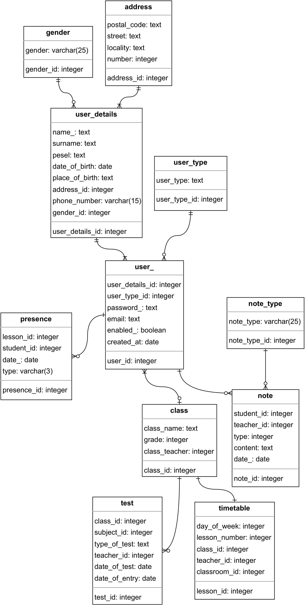

# School electronic diary - new version

### Table of contents
* [Description](#description)
* [Technologies](#technologies)
* [Features](#features)
* [The project status](#the-project-status)
* [Sources](#sources)
  

## Description
The project is an imitation of an electronic journal. Its purpose is to display basic information about the student and his achievements, important dates, etc.
  

## Technologies
- HTML5, CSS (SCSS), JavaScript (+AJAX)
- PHP
- PostgreSQL (+PDO)
  

## Features
#### To do
- Adding student grades
- Displaying / marking the student's presence in individual lessons
- Displaying / adding tests on specific days for the student
- Viewing / adding / changing a student's timetable
- Displaying / adding remarks for the student
- View graphs of student achievement against the background of the class
- Displaying personal data of the student, school and teachers
#### Done
- Viewing student grades
  

## The project status
Under development - designing and coding individual sections in the dashboard.
  

## Application features - screenshots:
#### Login panel

#### Registration

#### Dashboard

#### Grades panel - student view

#### Grades panel - teacher view

## Part of the database structure

 

### Sources
This app is inspired by UONET+
(https://www.vulcan.edu.pl/strona/e-dziennik-dla-rodzicow-i-uczniow-288)
